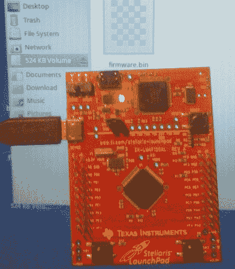

# Stellaris Launchpad 的海量存储引导加载程序

> 原文：<https://hackaday.com/2012/12/07/mass-storage-bootloader-for-stellaris-launchpad/>

[Andrzej Surowiec]喜欢某些恩智浦 LPC 开发板上提供的大容量存储引导加载程序的功能。他最近的项目是为 Stellaris Launchpad 编写一个大容量存储引导程序。只需将主板安装为 USB 存储设备并复制二进制文件，就可以将编译好的固件闪存到芯片中。该芯片有大量的闪存(引导程序本身占用了可用的 256 KB 中的 16 KB)，并且该板已经被设置为用作 USB 硬件。

在上面的链接页面有预编译的二进制文件，或者你可以从他的 github 库获得源代码。我们认为这个项目对其他人来说是一个好的起点。例如，使用[Andzej 的]工作作为实现基于文件系统的 I/O 控制[的基础应该相对容易，就像我们在 phatIO 项目](http://hackaday.com/2012/11/29/phatio-uses-file-system-to-control-external-hardware/)中看到的那样。