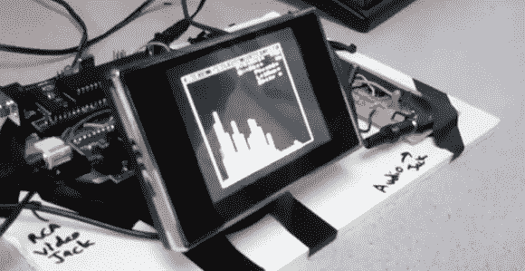

# 构建并行处理的频谱分析仪

> 原文：<https://hackaday.com/2012/12/08/building-a-spectrum-analyzer-with-parallel-processing/>

康奈尔大学(Cornell)的[Bruce Land]微控制器设计课已经到了期末，这个学期工作台上的项目看起来和以前一样棒。在他们的最终项目中，[亚历山大·王]和[比尔·乔]设计了一个音频频谱分析仪[，使用两个微控制器并行设置。](http://people.ece.cornell.edu/land/courses/ece4760/FinalProjects/f2012/ajw89_bwj8/ajw89_bwj8/index.html#top)

该频谱分析仪通过 3.5 毫米插孔从 iPod、手机或 CD 播放器中获取音频信号，并显示几十个频段的电平，就像 iTunes 中的音频可视化器或漂亮的汽车立体声显示器一样。为了显示这些频带，频谱分析仪首先需要对输入的音频信号执行快速傅立叶变换。虽然 FFT 非常快，但是计算是相当硬件密集型的；即使对于项目中使用的 ATMega1284 来说，计算频率并在电视上显示也有点多。

为了在他们的小显示器上绘制音频信号,[Alexander]和[Bill]将构建分为两部分——一部分用于计算音频，另一部分用于为显示器生成 NTSC 视频信号。

正如在休息后的视频中看到的那样，频谱分析仪工作得非常好，尽管它的工作频率只有 4kHz，但它足以看到大多数音乐中发生的事情。

[https://www.youtube.com/embed/qaiK_UoDqJw?version=3&rel=1&showsearch=0&showinfo=1&iv_load_policy=1&fs=1&hl=en-US&autohide=2&wmode=transparent](https://www.youtube.com/embed/qaiK_UoDqJw?version=3&rel=1&showsearch=0&showinfo=1&iv_load_policy=1&fs=1&hl=en-US&autohide=2&wmode=transparent) [https://www.youtube.com/embed/9dBX1sY3pYI?version=3&rel=1&showsearch=0&showinfo=1&iv_load_policy=1&fs=1&hl=en-US&autohide=2&wmode=transparent](https://www.youtube.com/embed/9dBX1sY3pYI?version=3&rel=1&showsearch=0&showinfo=1&iv_load_policy=1&fs=1&hl=en-US&autohide=2&wmode=transparent)