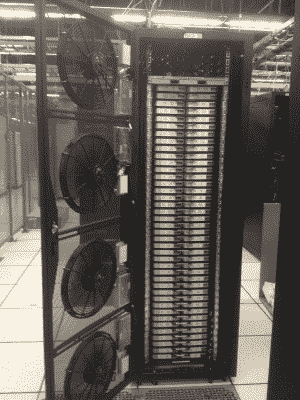

# 160 台 Mac Minis，一个机架

> 原文：<https://hackaday.com/2012/12/09/160-mac-minis-one-rack/>

[史蒂夫]需要 Xserve 的替代品，因为苹果已经停止生产它了。他的解决方案是将 [160 台 Mac Minis 放入一个机架](http://simbimbo.wordpress.com/2012/11/13/time-to-light-the-fires-and-kick-the-tires/ "Mac Mini Rack")。这相当于 640 个真正的内核，如果算上超线程，就是 1280 个。

首先，史蒂夫必须处理架子。没有人做一个 1U 架子来装四个迷你电脑，所以[史蒂夫]和一个供应商合作设计了他自己的架子。曾经的挑战是管理每辆 Mini 的废气。塑料嵌件旨在确保 exaust 不会被吸入 adjancent Mini 的进气口。

由 160 台电脑组成的阵列将会散发大量热量。为了提供足够的气流，[史蒂夫]用四个汽车散热器风扇建造了一个定制的冷却门，连接到一个 40A 的 DC 电机控制器。这都集成到机架的门上。

另一个挑战是给所有的迷你电脑供电。由于这种设计是为数据中心设计的，所以 Minis 必须从配电装置(PDU)获取电力。这需要大量的 PDU 和电缆。解决方案:一根一到四根 Y 型电缆用于迷你电脑。这使得每四个架子可以插入一个插座。

最终的结果是一个专业外观的机架，可以取代一个 Xserves 机架，并具有将来升级的容量。