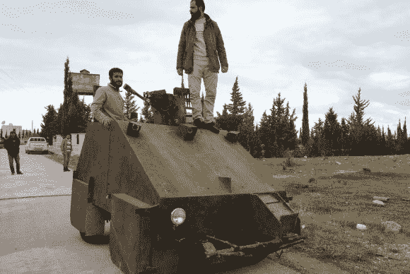

# 自制坦克加入叙利亚战争

> 原文：<https://hackaday.com/2012/12/10/homemade-tank-joins-the-battle-in-syria/>

当一个黑客为了他们国家的自由而投入战斗时，他会做什么？当然，他从零开始建造一辆坦克。称它为坦克有点夸张，因为它没有踏板。但它的顶部安装了一门大口径火炮，并且有厚重的装甲。

里面有足够两个人的空间。这张照片里看起来科技含量不高的东西，在驾驶舱里却是另一回事。一对 LCD 监视器显示来自五个不同摄像机的图像。你可以在车的前面看到保护其中三个的护罩，第四个作为后视图。安装在枪上的第五个摄像头让乘客可以看到他瞄准的地方。PS1 控制器可以旋转它，我们假设它也有一个火的特性。请查看休息后嵌入的演示视频。

[https://www.youtube.com/embed/fB1BDrFzFY0?version=3&rel=1&showsearch=0&showinfo=1&iv_load_policy=1&fs=1&hl=en-US&autohide=2&wmode=transparent](https://www.youtube.com/embed/fB1BDrFzFY0?version=3&rel=1&showsearch=0&showinfo=1&iv_load_policy=1&fs=1&hl=en-US&autohide=2&wmode=transparent)

[via [Reddit](http://www.reddit.com/r/pics/comments/14ljlk/syrias_homemade_tank/)