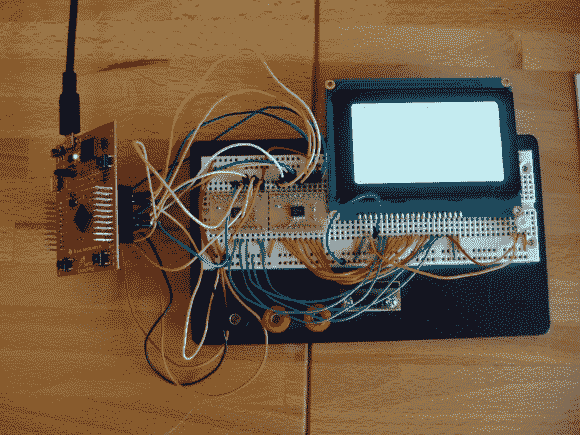

# 电平转换器，使您的所有硬件(5.5V 及以下)相互兼容

> 原文：<https://hackaday.com/2012/12/11/level-converters-to-make-all-your-hardware-5-5v-and-under-play-with-each-other/>

我终于为我自己的一个项目留出了一些时间。我最近一直在玩 ARM 微控制器，想试试我使用 KS0108 协议的 GLCD 显示器。它是 5V 的，但我听说其中一些显示器将与 3.3V TTL 一起工作。但数据手册告诉我并非如此。我尝试使用一个 5V 的上拉电阻，并将 Stellaris Launchpad 引脚配置为开漏，但低电压不会低于显示器所需的 0.3V 阈值。我唯一的选择是使用某种级别转换。实际上，我最终使用一对 TXB0108 电平转换器来驱动 KS0108。

我想这一定是以前做过的，所以我去 Sparkfun 查了一下。他们的产品要么是单行道，要么有一个你必须自己驾驶的方向标。我认为必须有一个双向的解决方案，在 Mouser 上搜索后，我找到了 TXB0108。这正是我一直在寻找的，正如你所看到的，我蚀刻自己的电路板，使 TSSOP 芯片试验板兼容。我已经记录了这个过程，你可以在我上面的链接中找到代码和电路板文件。

**更新:**一条 [Reddit 评论](http://www.reddit.com/r/ECE/comments/14mssh/level_converter_txb0108_lets_me_use_5v_tools_with/)提到这款芯片在[Adafruit](http://www.adafruit.com/products/395)的分线板上有售，如果你感兴趣的话。