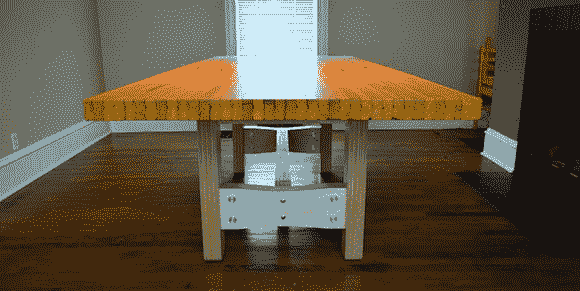

# 保龄球馆制作的漂亮桌子

> 原文：<https://hackaday.com/2012/12/11/beautiful-table-made-from-a-bowling-alley/>

对于工作台、书桌，甚至是餐桌来说，没有什么比一块巨大的层压枫木更适合用作桌面了。无论是屠夫块、商店级桌子[还是[Dillon]改造的保龄球道](http://www.instructables.com/id/Bowling-Lane-Table/?ALLSTEPS)的形式，层压枫木都是最好的桌面之一。

不久前，[Dillon]在 Craigslist 上发现有人愿意以大约 300 美元的价格出售保龄球馆的一段 8 英尺长的场地。在用卡车把这个两英寸半厚、250 磅重的庞然大物运回家后，开始着手把它改造成餐桌。

保龄球馆是由工人铺设枫木条，一次一排地将它们钉在一起建造的。当安装在混凝土平台上时，这提供了稳定的表面，但对于桌子来说是完全不够的。为了防止他的保龄球球台下垂，[Dillon]在球道的宽度上留出三个铝条槽。然后，这些木条被拧进车道上的每一根枫木条，形成一个非常坚固的表面。

然后，在大型工业砂带机的帮助下，加固车道被重新铺设，并涂上一层缎面聚氨酯。桌腿由 CNC 加工的 18 毫米波罗的海桦木胶合板制成，用金属紧固件固定在一起。

最终的结果是一张可以使用 100 年的漂亮桌子。考虑到[Dillon]在这张桌子上花了不到 1000 美元——以及 8 英尺 2.5 英寸屠夫块的价格——我们将称之为[Dillon]、他的孩子和孙子的胜利。