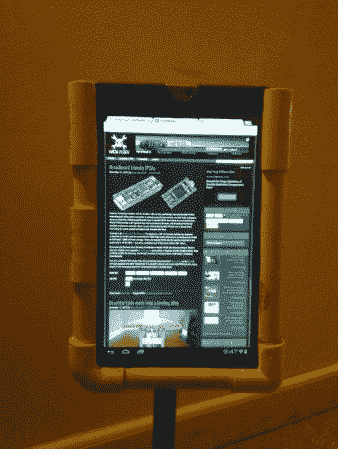

# 平板电脑钻机采取乐谱数字化

> 原文：<https://hackaday.com/2012/12/12/tablet-rig-takes-sheet-music-digital/>

[Bill Dudley]的妻子想用几个不同的平板电脑来显示乐谱。当然，一个合适的乐谱架可以很好地支撑设备的重量，但是如果它没有固定好，你很快就会看到一个坏掉的设备。[Bill]的解决方案是用 PVC 制作这个平板电脑支架。

上面的图像并没有告诉他如何做到这一点的整个故事。但是如果你仔细观察，你会发现管子实际上是作为一个框架，而不是摇篮。在测量、切割并将所有组件粘合在一起后，他在 u 形 PVC 框架内侧切割出一条通道。该通道的厚度正好与药片的厚度相同，可以安全地固定设备。乐谱架上的一个底座构成了这个装置的其余部分。

使用 USB 脚踏板可以翻页。这对于使用数字音乐收藏的音乐人来说太棒了，比如真正的书。