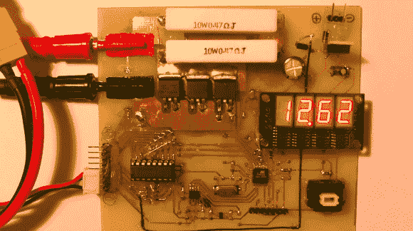

# 脂肪内阻测量工具

> 原文：<https://hackaday.com/2012/12/12/lipo-internal-resistance-measurement-tool/>

这是一个用于测量锂聚合物电池内阻的刮擦式[测量仪。[bl uer cs ABA]使用的脂肪细胞为钢筋混凝土车辆和 thet 采取相当殴打从他们提供的电机。这意味着他只能从每个细胞中获得大约 100-200 个周期。要想知道一个人处于生命周期的哪个阶段，你可以测量其内部电阻，电阻越大说明年龄越大。[bl uer]提到您可以购买一个仪表来完成这项工作，但这有什么意思呢？](http://cseb.hu/lipo_rin/)

因为他有自己的工具，所以他为读数定义了自己的参数。在对不同测试周期驱动的不同负载进行试验后，他能够推断出一个估计电阻测量值的方程。正如你在休息后的片段中看到的，这发生得非常快。他所要做的就是连接手机并按下一个按钮。进行测量，各种数据点显示在四个 7 段显示器上。

[https://www.youtube.com/embed/Lo2obGQtks8?version=3&rel=1&showsearch=0&showinfo=1&iv_load_policy=1&fs=1&hl=en-US&autohide=2&wmode=transparent](https://www.youtube.com/embed/Lo2obGQtks8?version=3&rel=1&showsearch=0&showinfo=1&iv_load_policy=1&fs=1&hl=en-US&autohide=2&wmode=transparent)