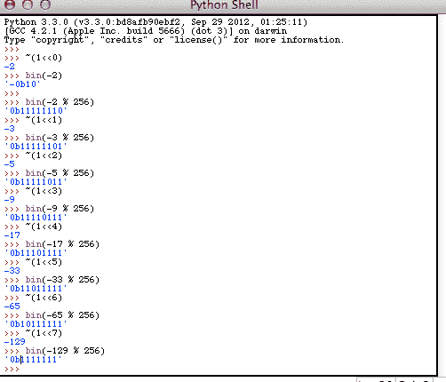

# 谈到二进制数学，Python 可以成为你最好的朋友

> 原文：<https://hackaday.com/2012/12/13/python-can-be-your-best-friend-when-it-comes-to-binary-math/>

如果你对微控制器感兴趣，你会知道用二进制来思考和执行数学运算的能力是必须的。[Joe Ptiz]一直在寻找一种方法，在编码时不被数学分心，同时仍然将二进制字符串放在脑海的最前面。他想出的解决方案是[使用 Python 解释器作为二进制数学助手](http://joepitz.wordpress.com/2012/12/09/tutorial-bit-banging-and-boolean-math-without-the-math/)。

我们知道您可以使用 Python 在十进制、十六进制和二进制之间进行转换。但我们未能跃进使用它来排除逐位操作的故障。我们可以看到，这在处理类似 STM32 芯片上的 16 位 I/O 端口时特别有用。对我们来说，在脑子里做 8 位数学很容易，但把它翻倍就是另一回事了。

上图是[Joe 的]教程中的一个截图。这说明了几个不同的按位运算符，给定十进制输入，但显示二进制作为输出。他还说明了如何使用 python 从 C 代码中测试方程，首先设置变量，粘贴方程，然后打印结果，看看输出是否是预期的。