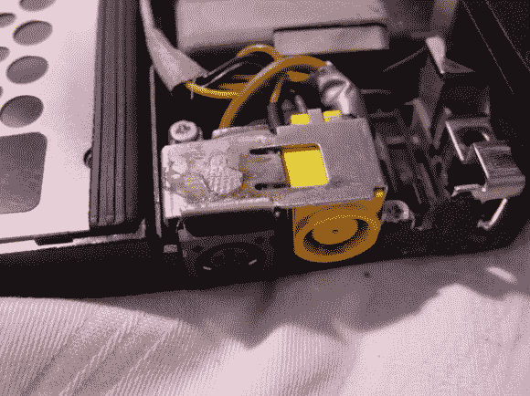

# 一台笔记本电脑使用两个充电器

> 原文：<https://hackaday.com/2012/12/13/using-two-chargers-with-one-laptop/>

这是一场骚乱！[Nico]有了一台新电脑，他不想更换六根电源线，这些电源线都是他在家中和工作场所精心布置的。所以他只是[增加了第二个充电插孔，接受不同风格的连接器](http://www.nicobaumgartner.ch/blog/?p=257)。

首先，笔记本电脑是二手的，但对他来说是新的。因此，拆开它并焊接一个新的插孔不会影响已经过期的保修。他在工作中可以获得无限量的戴尔笔记本电脑充电器。它们的额定电压为 19.5 伏，这台电脑的充电器额定电压为 20 伏，所以他认为这应该没有问题。他没有更换旧的充电端口，而是在 RJ-11 连接器(用于电话调制解调器)的位置增加了第二个充电端口。现在，他不需要浪费钱为新旧机器购买更多充电器。

这不是我们第一次看到有人更换电源插座。但这是我们见过的第一台使用两种不同充电器的电脑。