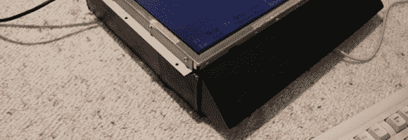
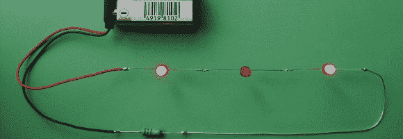
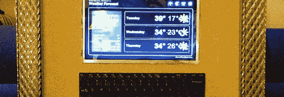
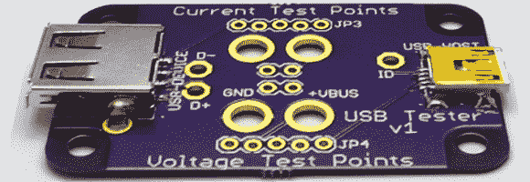

# 黑客日链接:2012 年 12 月 13 日

> 原文：<https://hackaday.com/2012/12/13/hackaday-links-december-13th-2012/>

纸箱电脑

[Alistair] chapman 的零件箱里有一台屏幕破碎的笔记本电脑。他知道他手头有一个液晶面板，可能会与它一起工作，但它不适合在案件中。他的解决方案是把所有的电脑零件从主板上移植到一个纸箱里。

**这把小提琴是垃圾**

这个乐队的孩子们住在一个建在垃圾填埋场上的村庄里。但是他们充分利用他们所拥有的。这个管弦乐队由用垃圾制成的乐器组成，它们看起来工作得很好。[谢谢布鲁斯]

**更多 LED 神秘拼图**

[亨里克]又来了。他把一些非常令人印象深刻的电路放在一起，在你的工程头脑中玩把戏。他最新的产品是三个串联的发光二极管。仔细观察，你会发现他们的表现不如预期。观看[对他之前的一个谜题](http://www.youtube.com/watch?v=-KMLmpC7-Ls)的解答会帮助你弄清楚他是如何做到的。他的作品简直令人惊叹。

**作为专用气象站的上网本**

不想摆脱旧的但仍然工作的硬件，[复古烤面包机] [通过将屏幕、键盘和跟踪板安装在相框中，建立了一个专用的气象站](http://www.reddit.com/r/gadgets/comments/13yimm/throwing_out_old_computers_is_a_bummer_i/)。

**测试 USB 项目的电流和电压**

该开发板是 USB 设备的通道。它[使电压和电流测试你的设备非常简单](http://www.mobilewill.us/2012/12/our-first-product-usb-tester.html)。