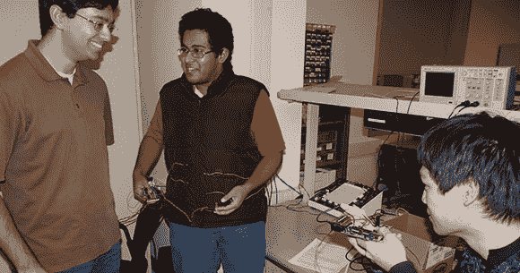

# 敌我识别系统防止你射杀你的朋友

> 原文：<https://hackaday.com/2012/12/14/iff-system-keeps-you-from-shooting-your-friends/>

敌我识别系统——敌我识别——是军用飞机在战斗状态下用来判断另一架飞机是由飞行员同伴驾驶还是由敌人驾驶的。对于地面上的靴子来说，友军开火通常被认为是一件非常糟糕的事情，所以康奈尔大学[Bruce Land]的 ECE 4760 班的一些学生决定为他们的最终项目制作一个可穿戴版本的 IFF。

[文浩·路易斯]和[Aadeetya Shreedhar]将他们的项目分为两个部分:发起者单元和接收者单元。发起方单元向接收方单元发送一个加密密钥，然后接收方单元回复说，“不要开枪。”[Wen]和[Aadeetya]需要在使用射频通信还是基于激光的通信之间做出选择，但是获取或构建具有必要方向性的无线电天线的困难使得激光成为显而易见的选择。

接收器单元有八个连接到背心的光电晶体管，当激光照射光电晶体管时，接收器单元将通过 Wi.232 无线电模块回复启动器单元。在敌人获得这些背心的情况下，该项目包括一个脉冲检测电路，当穿着者的脉冲降至零时，该电路将删除加密密钥。有点病态，但休息后的视频肯定让它看起来很酷。

[https://www.youtube.com/embed/wydz_zS5D50?version=3&rel=1&showsearch=0&showinfo=1&iv_load_policy=1&fs=1&hl=en-US&autohide=2&wmode=transparent](https://www.youtube.com/embed/wydz_zS5D50?version=3&rel=1&showsearch=0&showinfo=1&iv_load_policy=1&fs=1&hl=en-US&autohide=2&wmode=transparent)