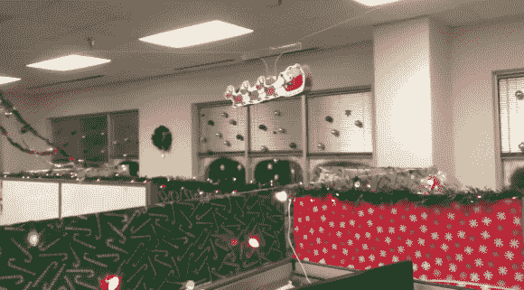

# 装饰立方体

> 原文：<https://hackaday.com/2012/12/14/deck-the-cubes/>

谈到今年的圣诞装饰，[MrBuildIt]名副其实。他建造了一个装置，将圣诞快乐从隔间的一端传播到另一端。

在休息后的演示视频中，你会看到该系统由一个精心设计的 Android 应用程序控制。当圣诞老人巡视时，它让你从三首不同的圣诞歌曲中选择(或者根本没有音乐)。该应用程序包括开关所有灯的按钮，但我们认为看到圣诞老人飞过时打开灯会更有趣。

雪橇和三只小驯鹿悬挂在滑轮系统上。当他们到达办公室的一端时，霍尔效应传感器充当限位开关。从外观上看，你可能会认为圣诞老人在回程中会向后飞，但有一个伺服系统可以翻转这个东西，以便他走正确的方向。

当谈到办公室装饰时，这是一个相当棘手的问题。我们想看看你对自己的装饰品做了什么奇怪的事情。在网上获取一些详细信息，然后[发送一个链接给我们](http://hackaday.com/contact-hack-a-day/)！

[https://www.youtube.com/embed/FQ5pFvzvTAo?version=3&rel=1&showsearch=0&showinfo=1&iv_load_policy=1&fs=1&hl=en-US&autohide=2&wmode=transparent](https://www.youtube.com/embed/FQ5pFvzvTAo?version=3&rel=1&showsearch=0&showinfo=1&iv_load_policy=1&fs=1&hl=en-US&autohide=2&wmode=transparent)

[via [Reddit](http://www.reddit.com/r/arduino/comments/14s9ux/my_brother_and_i_made_a_smartphone_controlled/)