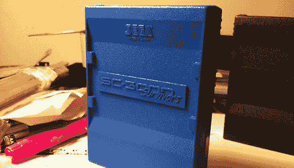

# 模具制作和制作自己的外壳的冒险

> 原文：<https://hackaday.com/2012/12/15/adventures-in-moldmaking-and-making-your-own-enclosures/>

SC-3000 幸存者的工作人员一直在为古老的世嘉 SC-3000 电脑开发一种能够存储几十款游戏的盒式磁带。印刷电路板工作得很漂亮，但为他们的墨盒做一个外壳让他们没有什么选择。他们可以使用 3D 打印机或简单地收集一大堆用过的弹壳，但[为弹壳](http://www.sc3000-multicart.com/sc3000-cart-case.htm)制作自己的模具是最好的解决方案。

为了给他们的多卡外壳制作模具，SC-3000 幸存者首先用一个旧的、用过的盒子制作了一个硅胶模具。虽然第一次制作模具的尝试令人鼓舞，但由于缺乏通风孔和在树脂凝固前晃动模具，一些问题开始出现。不久，一种制作树脂模型的合适技术被开发出来:使用大量的树脂，并且不要在固化模具上施加压力或橡皮筋。

我们总是对几片塑料、一些 Bondo 以及我们在其他机箱模块和外壳构建中看到的大量耐心和砂纸所能做的事情印象深刻。SC-3000 幸存者搭建了一个可以与任何邦多建筑相媲美的围栏，我们很高兴他们推出了这个教程。