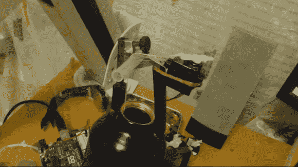

# 一个 Arduino 茶包

> 原文：<https://hackaday.com/2012/12/17/tea-bagging-an-arduino/>

[Dmitry Narkevich]喜欢浓茶，他的方法是在茶泡的时候摇动茶包。但是当你可以让 Arduino 为你沏茶的时候，为什么还要花时间去做这件事呢？如你所见，他安装了一个系统来移动浸泡在金属瓶中的茶包。

动作是由连接到 Arduino 的业余爱好伺服系统提供的。这使得计时过程变得非常简单，我们可以想象他添加警报只是时间问题，所以他会知道什么时候准备好了。但是真正的问题在于连接伺服系统和瓶子的装置。因为他要用它来喝水，所以组件需要易于拆卸，并且应该能够经受住每天几次被夹紧和取下的虐待。

该设备的基础是吉他弦枕。这意味着使用弹簧张力轻轻夹住吉他的指板，这样它已经被橡胶覆盖，这使它牢牢抓住瓶子的开口。伺服系统连接到订书机的金属部件上，绳子垂在一次性笔的主体上。请不要错过休息后的视频片段。

如果你手头没有伺服系统，你可以尝试使用光驱的滑轨[。](http://hackaday.com/2012/10/22/automate-your-tea-time/)

[https://www.youtube.com/embed/CEC_PDcNLxs?version=3&rel=1&showsearch=0&showinfo=1&iv_load_policy=1&fs=1&hl=en-US&autohide=2&wmode=transparent](https://www.youtube.com/embed/CEC_PDcNLxs?version=3&rel=1&showsearch=0&showinfo=1&iv_load_policy=1&fs=1&hl=en-US&autohide=2&wmode=transparent)

[via [Reddit](http://www.reddit.com/r/arduino/comments/14ts5c/arduinobased_teabag_oscillator/)