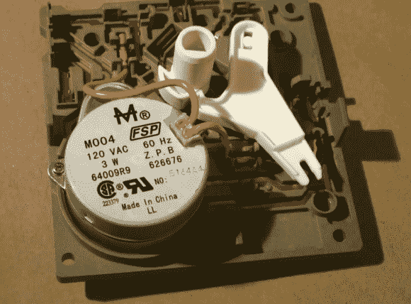

# 修理你的制冰机电机，而不需要购买一个全新的组件

> 原文：<https://hackaday.com/2012/12/17/repair-your-ice-maker-motor-without-buying-a-whole-new-assembly/>

自动制冰机可能会出很多问题。但是一个更常见的问题是，从集成托盘中舀出冰的马达在使用多年后会烧毁。[戴夫] [最近修理了一个普通的制冰机马达](http://www.youtube.com/watch?v=5JOv9yK5gv8)，向我们展示了它是多么的便宜和简单。休息后在视频里看看他是怎么做到的。

上图是制冰机的电机和齿轮箱。在拆卸之前，他将一张纸放在手指移动新形成的冰的路径上，以此验证问题出在电机上。在移除传感器臂和三个螺钉后，他能够从单元中拉出这个前部。两根电线夹在尽可能靠近电机的地方，电机本身只要拧一下就出来了。在确认齿轮没有损坏后，他通过谷歌搜索零件号(本例中为 M004 3W)找到了一个 2.50 美元的电机替换件。一旦新的单元到达，电机线的连接方式与向下打孔的以太网插孔连接绝缘电线的方式非常相似。

如果你的制冰机坏了，这是一个值得研究的问题。制造商可能会建议更换整个装置，这可能要花费 100 多美元……为了节省一些现金，这是一个值得的策略。嗯，我们猜想你总是可以建造自己的[非电动制冰机](http://hackaday.com/2008/08/29/solar-powered-ice-maker/)。

[https://www.youtube.com/embed/5JOv9yK5gv8?version=3&rel=1&showsearch=0&showinfo=1&iv_load_policy=1&fs=1&hl=en-US&autohide=2&wmode=transparent](https://www.youtube.com/embed/5JOv9yK5gv8?version=3&rel=1&showsearch=0&showinfo=1&iv_load_policy=1&fs=1&hl=en-US&autohide=2&wmode=transparent)