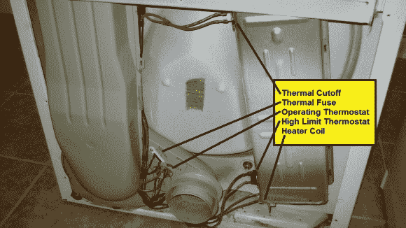

# 电动干衣机修理加热东西

> 原文：<https://hackaday.com/2012/12/18/electric-clothes-drier-repair-heats-things-up/>

[How To Lou]确实向我们展示了如何做相当多的事情。这次他要对付的是一个不会加热的电动干衣机。我们一直在深入研究我们自己的电器，我们认为[Lou]实事求是的演示将有助于您获得调查问题的信心，然后再决定这是否是一项交给修理工的工作。

这张图片显示了移除保护面板后的干衣机背面。框外是功能原理图，列出了每个器件及其电阻测量值。Lou 在这张图片中标记了这些部分，以帮助我们理解我们正在看的东西。在休息后的视频中，他开始进行与维修相同的故障诊断。他抓起他的万用表，在拔掉电线后，用它来测试每个元件的电阻。除了加热器线圈之外，所有的读数都应该为零欧姆，示意图上的额定值为 7.8-11.8 欧姆。高温恒温器松动，并测量到无穷大的电阻。这一点，再加上一边烧焦的电线，就是罪魁祸首。与昨天的制冰机维修一样，[Lou]搜索零件上的编号，以找到他需要的替换件。

[https://www.youtube.com/watch?v=Rj85TtUIVPM](https://www.youtube.com/watch?v=Rj85TtUIVPM)