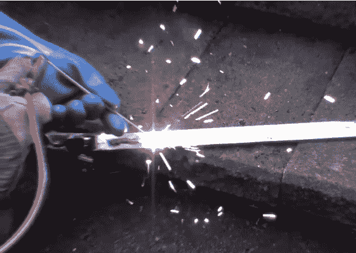

# 焊接超过 100 个 A123 锂电池

> 原文：<https://hackaday.com/2012/12/18/welding-with-over-a-hundred-a123-lithium-cells/>

Bass 医生]需要在他的电动自行车上做一些焊接工作。问题是他以前从未焊接过，也没有任何工具。如你所见，这并没有阻止他。他用回收的 DeWalt A123 电池制成的自行车电池为他的 diy 焊接设备供电。

他有一个巨大的可调电阻器，负责限制电流。80 安培的电流似乎对他选择的焊条最有效。值得注意的是，当他展示焊机的每个部分时(见休息后的剪辑),用于正负引线的电线颜色与惯例相反。他的正极接线是黑色的，而他的接地是红色的。

为了进行焊接，他将一个类似跳线的夹子连接到他的工件上，作为正极。为了握住焊条，他在一把老虎钳上钻了一个孔，并用螺栓固定住负极引线。这样，当他的另一只手引导焊嘴时，焊条的末端可以被夹在虎钳夹中。到目前为止，他仍在练习，但看起来他几乎准备好接受手头的工作。

[https://www.youtube.com/embed/WsD-xU4gtHM?version=3&rel=1&showsearch=0&showinfo=1&iv_load_policy=1&fs=1&hl=en-US&autohide=2&wmode=transparent](https://www.youtube.com/embed/WsD-xU4gtHM?version=3&rel=1&showsearch=0&showinfo=1&iv_load_policy=1&fs=1&hl=en-US&autohide=2&wmode=transparent)

[谢谢凉库]