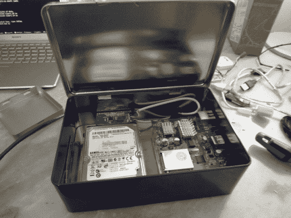

# 在一个盒子里拼凑 NAS

> 原文：<https://hackaday.com/2012/12/18/hacked-together-nas-in-a-box/>

[大卫]正在他的家庭网络上提供文件，这要感谢这个科学怪人的网络附加存储设备。看起来他从零件箱里搜出了所有好的零件来组装。

这个盒子是一个铁盒，可能是用来装纸牌/棋盘游戏或一些节日礼物的。硬件从他从 Deal Extreme 买的 NS-K330 服务器开始。它有一个网卡和几个 USB 端口，但它往往运行得很热，所以他给主板的主芯片添加了一个散热器。这两个硬盘都是老式笔记本电脑的 2.5 英寸外形。他使用一些 2.5 英寸到 3.5 英寸的安装适配器将它们连接到锡盒上。一对 USB 到 IDE 适配器脱下外壳，直接焊接到与服务器的 USB 端口连接的电线上。

有一个专门针对这种硬件的 Linux 发行版，但是[David]并不喜欢。他最终为此编译了 OpenWRT，并对提供的功能感到满意。