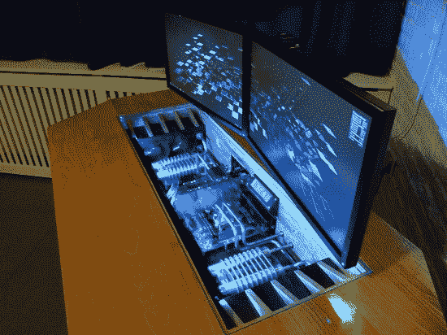

# 重金属电脑桌

> 原文：<https://hackaday.com/2012/12/18/heavy-metal-computer-case-desk/>

[这张桌子也是电脑机箱](http://forum.coolermaster.com/viewtopic.php?f=52&t=15726)。从这个角度来看，它可能看起来不多，但建设日志有数百张图片，可以被称为金属制造色情。桌面是木制的，但所有其他部分都是由不锈钢制成的。

不是由[Paslis]制造的三个部件是一对腿和支撑屏幕的柱子。这些部件实际上是升降柱，只需按一下按钮，就可以调节桌子和屏幕的高度。建造始于一个容纳计算机内部的子表面。经过仔细的切割、弯曲、焊接和抛光，它看起来就像商业厨房的工作台面。在将提升腿连接到该组件上之后，桌子的脚由方管形成，然后用不锈钢蒙皮，以匹配子表面的最终外观。在支架、装饰件、烤架和木质装饰上花费了无数个小时后，他在总装前把所有东西都送去喷漆。

当然，这与昨天的案例桌是不同的领域。但是一个凡人也能做到，而这肯定是一个有经验的商人的工作。

[谢谢安德烈亚斯]