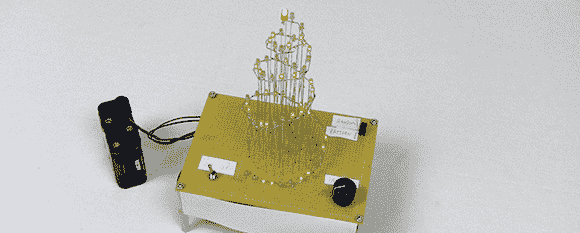

# 数字逻辑的圣诞树

> 原文：<https://hackaday.com/2012/12/19/o-christmas-tree-of-digital-logic/>

PyroElectro 公司的[Chris]正在为圣诞节做准备，他们制作了一棵 LED 圣诞树。与我们在这个假期看到的其他电动圣诞树不同，[Chris]完全用数字逻辑设计了他的圣诞树——不包括微控制器。

在一块 perf 板上构建的树[Chris]是 64 个绿色 led 的美丽螺旋排列。虽然我们确信将所有的 led 焊接到正确的高度，但[Chris] [让用电路创建 3D 结构看起来如此容易](http://www.pyroelectro.com/projects/christmas_tree_digital_hardware/hardware.html)。

led 由一组八个移位寄存器驱动，这些移位寄存器本身由可预测的 555 定时器芯片或由几个十六进制反相器构建的电路产生的伪随机模式计时。通过将圣诞树设置为顺序模式，一对灯沿着圣诞树的螺旋缓缓移动。如果设置为随机模式，随机数量的发光二极管点亮，并沿发光二极管阵列移动。

[https://www.youtube.com/embed/GZNFbE0fO0U?version=3&rel=1&showsearch=0&showinfo=1&iv_load_policy=1&fs=1&hl=en-US&autohide=2&wmode=transparent](https://www.youtube.com/embed/GZNFbE0fO0U?version=3&rel=1&showsearch=0&showinfo=1&iv_load_policy=1&fs=1&hl=en-US&autohide=2&wmode=transparent)