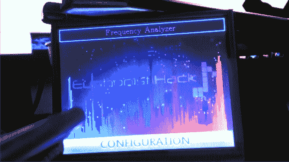

# Stellaris 发射台和升压包用作频率分析仪

> 原文：<https://hackaday.com/2012/12/19/stellaris-launchpad-and-booster-packs-used-as-frequency-analyzer/>

[Jordan Wills]厌倦了被限制在 8 个像素的分辨率，厌倦了在他的工作空间里乱丢跳线。他开始使用助推器来升级他的 [Stellaris Launchpad 频率分析仪项目。你可能还记得这个项目最初的迭代](http://euphonistihack.blogspot.com/2012/12/the-writeup-2-electric-boogaloo.html)[使用一个 8×8 的 LED 矩阵来绘制音频频谱](http://hackaday.com/2012/09/06/frequency-analyzer-built-from-the-new-stellaris-launchpad/)。通过这次升级，他真正发挥了 ARM 芯片的威力。

他对这个项目的第一个改进是旋转他自己的音频输入板。它有一个用于输入的标准耳机插孔和一些无源元件，用于将信号转换到 ADC 测量范围内。该屏蔽有两个双引脚接头和一组四个支脚。这样，它可以插入发射台底部的母头，并为组件提供稳定的底座。

设置的第二部分是硬件的 LCD 升压包。Kentec 制造了这款 3.5 英寸 320×240 液晶显示器(EB-LM4F120-L35)，配有电阻覆盖层，使其具有触摸敏感性。分辨率的提高和不同颜色的可用性给了[乔丹]大量的工作。由于这个插件是为 Launchpad 设计的，并且已经有一个可用的驱动程序库，因此他可以专注于调整 FFT 输出以用于显示和添加新功能。请不要错过在休息后的视频中看到他的成就。

[https://www.youtube.com/embed/1ZK5W2Hotf0?version=3&rel=1&showsearch=0&showinfo=1&iv_load_policy=1&fs=1&hl=en-US&autohide=2&wmode=transparent](https://www.youtube.com/embed/1ZK5W2Hotf0?version=3&rel=1&showsearch=0&showinfo=1&iv_load_policy=1&fs=1&hl=en-US&autohide=2&wmode=transparent)