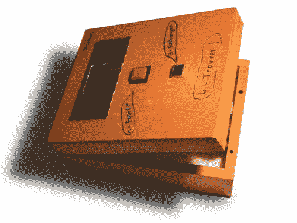

# 基于 STM32 和 GPS 手表的逆向地理缓存

> 原文：<https://hackaday.com/2012/12/19/reverse-geocache-based-on-stm32-and-gps-wristwatch/>

不知怎么幸运地在垃圾堆里找到了一个 GPS 手表。它的液晶显示屏坏了，所以在下一次徒步旅行中没什么用处，但他知道它仍有潜力。他使用 GPS 模块和一些其他部件[建造了这个反向地理缓存盒](http://renaud.schleck.free.fr/geocache.php)。

反向地理缓存是一个锁定的容器，只能在预定义的地理位置打开。我们在这里已经看到了很多这样的项目，像[这个会说话的](http://hackaday.com/2012/01/20/a-talking-reverse-geocache-puzzle-box/)，或者[这个作为圣诞礼物赠送的](http://hackaday.com/2011/01/02/reverse-geocaching-christmas-gift-box/)。它们是受欢迎的项目，因为它有独特的内部获奖方法，也因为它不需要太多的硬件来建造一个。一旦 Renaud 有了 GPS 模块，他只需要一个用户界面、锁定机制和一个微控制器就可以把它们组合在一起。

这个界面使用一个旧手机的屏幕和一个按钮。锁定系统是一个从笔记本电脑光驱中抢救出来的微型齿轮马达。这些以及 GPS 观察板都由 STM32 微控制器监控，他使用 OpenOCD 和 Bus Pirate 对 STM 32 微控制器进行编程。

[via [Reddit](http://renaud.schleck.free.fr/geocache.php)