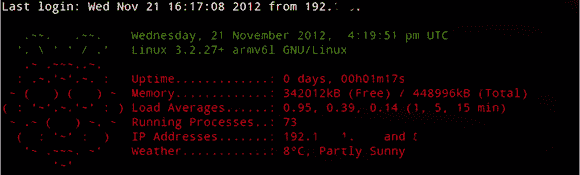

# 树莓派的定制 MOTD

> 原文：<https://hackaday.com/2012/12/20/custom-motd-for-the-raspberry-pi/>

Raspberry Pi 在一个无头配置中有如此多的用途——特别是随着 Raspi Model A 的即将发布——我们很惊讶有人花了这么长时间才发送一种方式来[创建一个自定义的每日消息](http://www.raspberrypi.org/phpBB3/viewtopic.php?t=23440),每当你 SSH 到每个人最喜欢的 Linux 板时，它就会显示出来。

服务器使用 MOTD 向新用户显示消息，或者仅向服务器管理员显示系统信息。这是一个存储在/etc/motd 中的简单文本文件，但是通过一些适当的 Unix 技巧，可以显示正常运行时间、空闲内存，甚至是 Raspi 所在位置的天气。

Raspberry Pi 论坛上的[yanewby]创建了一个漂亮的小 MOTD，它从互联网上抓取天气数据，并将其显示在 Raspberry Pi 标志的 ASCII 渲染图旁边。当然，像 Unix 中的所有东西一样，这个 MOTD 可以被修改来做任何事情，从查看你的 Twitter 到给你的手机发短信。