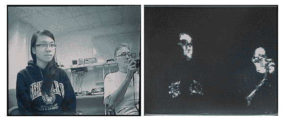

# 康奈尔大学的两个计算机视觉建筑

> 原文：<https://hackaday.com/2012/12/20/two-computer-vision-builds-from-cornell/>

康奈尔大学(Cornell)教授布鲁斯·兰德(Bruce Land)经常提交我们的建议。通常他每学期都会发几个本科电子课程的链接。现在秋季学期终于结束了，是时候开始更雄心勃勃的硕士项目了。

首先是[一个头戴式眼球追踪器](http://www.youtube.com/watch?v=qmCi47hM0nM)，【Anil Ram Viswanathan】和【Zelan Xiao】一起做了一个轻量级低成本的眼球追踪项目，它将记录用户在看什么。

眼球跟踪器硬件由安装在头盔上的两个摄像头组成。第一个摄像头面向前方，看着与用户相同的东西。第二个摄像头朝向用户的眼睛。一系列算法检测用户眼睛的虹膜，并将预期的凝视位置叠加在第一个摄像头的输出上。这是[设计报告](http://people.ece.cornell.edu/land/courses/eceprojectsland/STUDENTPROJ/2010to2011/arv44_zx52/arv44_report_201105200944.pdf)。PDF，自然。

接下来是在 FPGA 上实现的[人脸跟踪项目](http://www.youtube.com/watch?v=zcYAK2j0KSY)。这个项目开始于一个在 MATLAB 中的人脸跟踪算法的软件实现。[Thu-Thao Nguyen]将这个 MATLAB 代码翻译成 Verilog，并最终使她的硬件在 FPGA 开发板上运行。另一份[设计报告](http://people.ece.cornell.edu/land/courses/eceprojectsland/STUDENTPROJ/2012to2013/tnn7/tnn7_report_201212141110.pdf)。

在 FPGA 上运行人脸检测和跟踪系统是非常有趣的；FPGA 使面部跟踪成为一种功耗极低、有望实现低成本的解决方案，允许其用于便携式和消费类设备。

休息之后你可以看看这些项目的视频。

[https://www.youtube.com/embed/zcYAK2j0KSY?version=3&rel=1&showsearch=0&showinfo=1&iv_load_policy=1&fs=1&hl=en-US&autohide=2&wmode=transparent](https://www.youtube.com/embed/zcYAK2j0KSY?version=3&rel=1&showsearch=0&showinfo=1&iv_load_policy=1&fs=1&hl=en-US&autohide=2&wmode=transparent) [https://www.youtube.com/embed/qmCi47hM0nM?version=3&rel=1&showsearch=0&showinfo=1&iv_load_policy=1&fs=1&hl=en-US&autohide=2&wmode=transparent](https://www.youtube.com/embed/qmCi47hM0nM?version=3&rel=1&showsearch=0&showinfo=1&iv_load_policy=1&fs=1&hl=en-US&autohide=2&wmode=transparent)