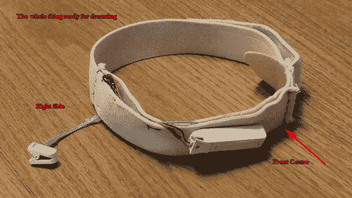

# 修改用于清醒梦的脑电图耳机

> 原文：<https://hackaday.com/2012/12/20/modifying-an-eeg-headset-for-lucid-dreaming/>

[Michael]、[Tom]和其他一些参与 Lucid Scribe 数据库项目的人一直在使用现成的脑电图设备来调用清醒梦。是的，那是你掌控自己梦想并成为神的地方。这需要在睡觉时戴上脑电图仪，这些产品在睡觉时穿起来不太舒服。[汤姆]决定[把一个 NeuroSky MindWave](http://lsdbase.org/2012/12/11/First-Dream-with-Modified-MindWave/) 拆开，把它变成一件可以整晚舒适佩戴的东西。

Lucid Scribe 数据库的人们用消费级脑电图设备记录他们的梦，通常是由 NeuroSky 制造的东西。NeuroSky MindWave 是目前最小最便宜的脑电图耳机，但它仍然是一种不利于睡眠的硬塑料设备。

[Tom]从他的意识波中取出所有的内脏和电子产品，并把它们绑在一个弹性头带上。MindWave 有两个传感器——前额和耳垂传感器。对于前额传感器，[汤姆]只需将一根金属丝焊接到一枚硬币上，并将其连接到松紧带上。stock MindWave 中的耳垂传感器是一个简单的夹子，保存在[Tom]的 mod 的库存配置中。

现在[汤姆]有了更舒适的脑电图设置，他可以继续提高他的清醒梦技能，甚至尝试在梦里通过莫尔斯电码交流。