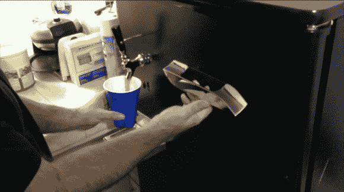

# 特斯拉 Model S 手柄分配啤酒；完成后隐藏

> 原文：<https://hackaday.com/2012/12/20/tesla-model-s-handle-dispenses-beer-hides-when-done/>

让我们面对现实吧，有时你需要从设计尖端电动汽车中抽出时间来过度设计一台啤酒冰箱。实话告诉你，在看到马特·布朗的努力后，我们现在有一种发自内心的渴望。他拿了一个啤酒冰箱，并从特斯拉 Model S 上添加了一个消失分配器手柄。

你可能认为这是一个昂贵的部分，你比你意识到的更正确。这甚至不是股票的一部分。这是一个被人扔进垃圾桶的原型。[马特]把它从遗忘中捡起来，在冰箱门上磨了一个斑点。你的普通人[乔]可能不知道[Model S 配有把手，把手可以与车身齐平](http://www.youtube.com/watch?v=UxavZ2QxuLY)。

[马特]挖出门内侧的绝缘材料，直到有空间为把手切一个洞。他们将组件夹在适当的位置，并使用喷雾泡沫重新绝缘，并将其粘合到位。Arduino 会监控水龙头下方的区域。当你把杯子放在壶嘴下面时，把手会伸长。当你拉它的时候，一个螺线管向前驱动水龙头手柄。这听起来很枯燥，但我们认为休息后的演示也会让你渴望一个。

[https://www.youtube.com/embed/plaQCqE1aEE?version=3&rel=1&showsearch=0&showinfo=1&iv_load_policy=1&fs=1&hl=en-US&autohide=2&wmode=transparent](https://www.youtube.com/embed/plaQCqE1aEE?version=3&rel=1&showsearch=0&showinfo=1&iv_load_policy=1&fs=1&hl=en-US&autohide=2&wmode=transparent)