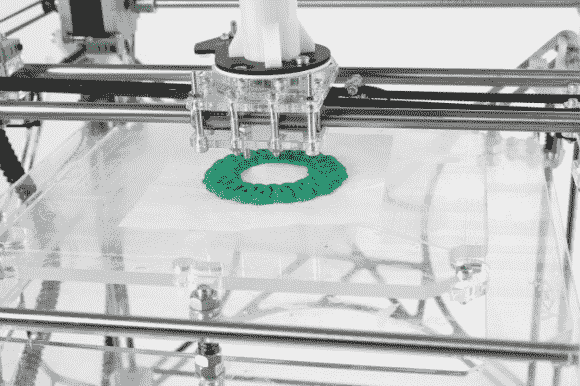

# 3D 打印圣诞饼干

> 原文：<https://hackaday.com/2012/12/20/3d-printed-christmas-cookies/>

这里有另一种方法可以在你当地的黑客空间(或者如果你碰巧有自己的 3D 打印机，可以在家里)感受节日的气氛。Ralph Holleis 写信来炫耀他的 3D 打印圣诞饼干。这个项目的大部分信息来自休息后嵌入的视频。他使用的挤出机头包括一个注射器，里面装满了我们认为是 Spritz 饼干面团的东西。在进入烤箱烘焙之前，它被挤压成一定的形状。

[Ralph]提到他使用 UNFOLD Pastruder 作为打印头。我们看了看，没有找到确切的设计，但它似乎可能与由名为[Unfold] 的用户设计的这个 Claystruder 头有关。如果你有上面看到的挤出机设计的确切链接，请在评论部分告诉我们。

如果你还没有这种类型的头，只需要打印安装支架和购买配套的注射器。但是你还需要压缩空气和阀门来控制面团的流动。打印你自己的饼干模具可能更容易。这是一个伟大的项目，对于那些没有机会使用[激光切割机做姜饼家务](http://hackaday.com/2012/12/17/more-details-about-laser-cut-gingerbread-houses/)的人来说。

[https://player.vimeo.com/video/55967024](https://player.vimeo.com/video/55967024)