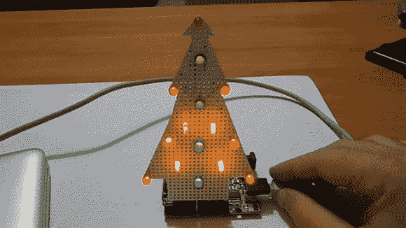

# 兼容 Arduino 的圣诞树

> 原文：<https://hackaday.com/2012/12/21/arduino-compatible-christmas-tree/>

没有 LED 圣诞树就没有节日，幸运的是【达尼洛】带来了[一棵 Arduiinofied LED 圣诞树](http://www.danilolarizza.com/arduino-christmas-tree/)(意大利语，[翻译](http://translate.google.com/translate?sl=it&tl=en&js=n&prev=_t&hl=en&ie=UTF-8&eotf=1&u=http%3A%2F%2Fwww.danilolarizza.com%2Farduino-christmas-tree%2F&act=url))。

在过去的一周里，我们已经看到了 LED 圣诞树[的数字逻辑](http://hackaday.com/2012/12/19/o-christmas-tree-of-digital-logic/)和一个伟大的[自由电路版本](http://hackaday.com/2012/12/17/attannenbaum/)。与其他建筑不同,[Danilo]的 LED 树使用了一块被巧妙地切割成圣诞树形状的原板。这个版本没有 PCB 只是很多裸线和很多耐心。

因为[Danilo]的树使用他的 Arduino 上的 PWM 引脚，所以可以用几个 90 度接头将他的树连接到 Arduino。这为他的树提供了一个很好的基础，并使得为他的项目建造一个专业外观的围栏成为可能。

休息之后你可以看看[Danilo]的树。

[https://player.vimeo.com/video/56054319](https://player.vimeo.com/video/56054319)