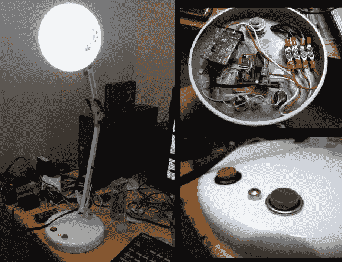

# 为这款台灯添加计时器功能

> 原文：<https://hackaday.com/2012/12/21/adding-a-timer-feature-to-this-desk-lamp/>

[Steven Mackaay]增加了一个简单的用户界面，为他的台灯实现了一个关闭定时器。他的项目日志分为两部分，试验板和实际实现。

他想要一些不属于这个建筑的东西。第一个是 LED，可以帮助他在黑暗中找到灯。第二个特性是具有不同延迟选项的关断定时器。为了让一切正常工作，他使用 PIC 微控制器来驱动机械继电器。那个继电器将主电源切换到灯上。现在他用一个按钮来开关灯。另一个选择一分钟、五分钟或三十分钟的关闭定时器。控制电路的电源由电子内脏照片中的绿色壁瘤 PCB 提供。

这是一个非常通用的设置，可以应用于许多其他电源开关应用。只需将逻辑硬件连接到某种类型的继电器上。