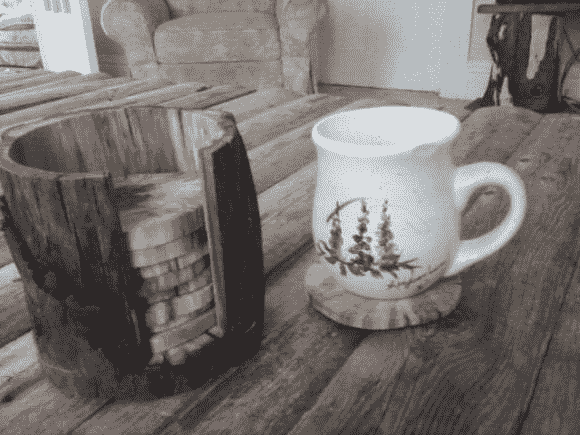

# 只用两种工具制作的圆木杯垫

> 原文：<https://hackaday.com/2012/12/23/log-coasters-made-with-just-two-tools/>

还在寻找完美的礼物吗？[Joel Witwer]向我们展示如何制作一套便宜的原木杯垫和支架。他计算出他在这个项目上只花了 5 美元，从我们所能知道的来看，这些钱都花在了他用来完成木块的聚氨酯上。

它始于他在路边发现的一根外形有趣、大小合适的木头。我们不确定干燥股票的来龙去脉，以确保它不会破裂，但我们希望他考虑到这一点。手里拿着原材料，他走向带锯。切割开始时，将原木两端弄成直角，同时切割成最终长度。然后他把支架的底部切掉。剩下的部分被直立起来，这样他就可以把木头的芯切掉。这是切割每个杯垫的原材料。纺锤形打磨机用于清理所有碎片。涂抹面漆前的最后一步是将支架的底部和侧面粘在一起。

[Joel]在他的 Reddit 帖子中给出了一些建议。他说，在切割杯垫切片时，你应该抓紧，因为圆形的原料会旋转。他还提到，一些切片并不像它们应该的那样平整，如果你是为自己切割这些切片的话，这是值得考虑的事情。