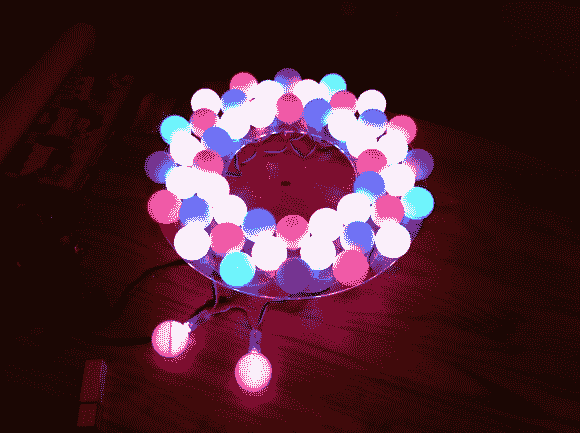

# 由一串 LED 灯组成的动画节日花环

> 原文：<https://hackaday.com/2012/12/23/animated-holiday-wreath-from-a-string-of-led-lights/>

【丹尼斯·亚当斯】[花环灯项目](http://www.sector67.org/blog/2012/led-holiday-wreath-build/)看起来还不错。但他做了一些惊人的编码，产生了一整套有趣的动画模式，真正为这个项目敲定了交易。不要错过休息后的视频，他展示了他所有的努力工作。

他从一串可单独寻址的发光二极管开始。这些是 12 毫米的品种，就像 Adafruit 销售的一样(我们已经看到它们在许多项目中出现)。为了安装每个像素，他尝试了几种不同的原型，然后选择了一个直径为 14 英寸的环。该设计是由丙烯酸激光切割而成，带有交错排列的孔来容纳每个 led 环。最后的润色是添加乒乓球来漫射光线。

正如我们前面提到的，灯光图案确实为项目添加了点睛之笔，但也有更多的功能。[Dennis]加入了监控花环推特信息的功能。当他收到一条新的推文时，一个不同的动画会让他知道这件事。

[https://www.youtube.com/embed/MjPOFIJPyIw?version=3&rel=1&showsearch=0&showinfo=1&iv_load_policy=1&fs=1&hl=en-US&autohide=2&wmode=transparent](https://www.youtube.com/embed/MjPOFIJPyIw?version=3&rel=1&showsearch=0&showinfo=1&iv_load_policy=1&fs=1&hl=en-US&autohide=2&wmode=transparent)

[谢谢克里斯]