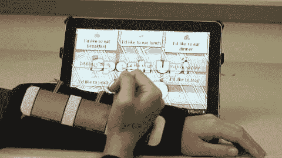

# 传感器套让残疾儿童使用平板电脑更加方便和有益

> 原文：<https://hackaday.com/2012/12/23/sensor-sleeve-makes-tablet-use-easier-and-benefitial-for-disabled-children/>

捏放是天赐之物(不应该申请专利),尽管我们为许多设备失去了物理键盘而悲伤，但我们使用平板电脑的频率几乎和使用完整的电脑一样高。但是触摸屏界面并不是对所有人开放的。那些手指不够灵活的人会发现这个界面在最好的情况下令人沮丧，或者在最坏的情况下完全不可用。亚特兰大儿科设备联盟的一组研究人员想出了一种方法，通过安装在你手臂上的传感器阵列来控制触摸屏平板电脑。

这个名为 Access4Kids 的项目不仅让平板电脑的使用成为可能，还将它作为一种康复手段。上面看到的 iPad 正在运行一个定制的应用程序，旨在与传感器套管一起使用。休息后的视频中解释了界面。每个传感器都可以作为一个单独的按钮，但硬件也可以处理来自所有三个传感器的顺序输入，如一个方向或另一个方向的滑动。如果他们能让孩子们对这个游戏感兴趣，它最终会成为自己的物理治疗教练，鼓励他们练习上半身的运动技能。

[https://www.youtube.com/embed/Mc6eygC5eQ8?version=3&rel=1&showsearch=0&showinfo=1&iv_load_policy=1&fs=1&hl=en-US&autohide=2&wmode=transparent](https://www.youtube.com/embed/Mc6eygC5eQ8?version=3&rel=1&showsearch=0&showinfo=1&iv_load_policy=1&fs=1&hl=en-US&autohide=2&wmode=transparent)

[via [DVICE](http://dvice.com/archives/2012/12/wireless-sleeve.php)