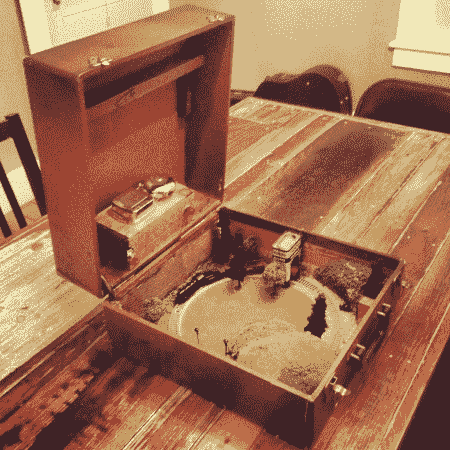

# 装在行李箱中的火车套件比你想象的要多

> 原文：<https://hackaday.com/2012/12/25/train-set-built-in-a-suitcase-does-more-than-youd-think/>

[Mario] [可以带着他的火车套装上路](http://suitcasemachine.blogspot.com/2012/12/train-set-in-suitcase.html)因为他是在手提箱里组装的。这本身就很棒，但他不仅仅是铺设了一圈轨道并用现实的风景围绕着它。这列火车是自动化的。

手提箱本身看起来有点滑稽，那是因为它最初是一台便携式留声机。移除转盘及其必要部件为 N 级铁路腾出了足够的空间(那真的是很小的东西！).一台带有电机护罩的 Arduino 驱动列车绕着环路行驶。一段轨道下面的簧片传感器提供机车在线路中位置的反馈。当它到达那个点时，火车停下来，一座桥被降低到轨道上，让一些看不见的交通通过。甚至有一些音频天赋，可以在休息后的视频中听到。它包括火车的汽笛声和安装在表壳上半部的钟声。

[https://www.youtube.com/embed/VgM5Xotab2I?version=3&rel=1&showsearch=0&showinfo=1&iv_load_policy=1&fs=1&hl=en-US&autohide=2&wmode=transparent](https://www.youtube.com/embed/VgM5Xotab2I?version=3&rel=1&showsearch=0&showinfo=1&iv_load_policy=1&fs=1&hl=en-US&autohide=2&wmode=transparent)