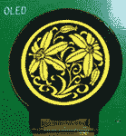
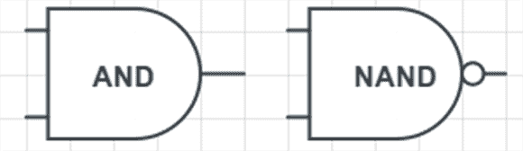
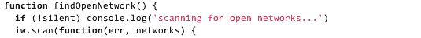

# 黑客日链接:平安夜，2012 年

> 原文：<https://hackaday.com/2012/12/24/hackaday-links-christmas-eve-2012/>

这是平安夜，与你的大家庭互动、吃饼干、喝点酒、看《虎胆龙威》的最佳时机。平安夜也意味着这是 Hackaday 的一个轻松的一天，所以这里有一些我们在过去几周遇到的很酷的事情。

#### 圆形有机发光二极管显示器

右边是一个圆形的有机发光二极管显示器。reddit [上的【ArtistEngineer】在阿里巴巴](http://www.reddit.com/r/ECE/comments/15a6y0/i_was_browsing_for_oled_displays_and_i_found_a/)上发现了这个展示。它是一个 1.13 英寸直径的显示器，分辨率为 128×128(是啊，我们也不知道)。这看起来像是一个很好的 DIY 手表、数字仪表或其他设备的显示屏，方形显示屏没有太大意义。

似乎有一些圆形有机发光二极管显示器制造商——包括[信利半导体](http://www.trulydisplays.com/oled/index.html)，他们碰巧为[提供了他们的圆形显示器](http://www.trulydisplays.com/oled/specs/1.13in%20128x128%20OEL9M0082-R-E%20Spec%20Round.pdf)的数据表——但合理数量的采购是一件痛苦的事情。有人想团购吗？想想编码极坐标显示的乐趣吧！

#### 用晶体管计算

你知道计算机是由简单的逻辑门、锁存器、缓冲器和其他各种数字电路组成的，但是我们如何把这些数字电路变成计算机呢？在过去的几个月里，[Andrew]发表了一堆关于数字逻辑应用的博客文章。在进入[、数字状态](http://www.gibiansky.com/2012/11/the-digital-state.html)和[电路和运算](http://www.gibiansky.com/2012/12/circuits-and-arithmetic.html)之前，从[“用晶体管计算”帖子](http://www.gibiansky.com/2012/10/computing-with-transistors.html)开始。那里有一些好的读物。

#### 在网页中嵌入 3D 对象

[http://skfb.ly/kihgfe10b?autostart=0&transparent=0&autospin=0&controls=1&watermark=1](http://skfb.ly/kihgfe10b?autostart=0&transparent=0&autospin=0&controls=1&watermark=1)

去吧。点击它。是 [Sketchfab](http://sketchfab.com/) 允许任何人在没有浏览器插件的情况下发布交互式 3D 设计。如果有人试图构建一个不依赖于 Makerbot 的 Thingiverse 克隆，可以考虑将它用于每个对象的预览页面。

#### 令人惊讶的是，夹馅面包是唯一没有在世界末日中幸存下来的东西。

虽然哀悼 Twinkie 的死亡是没有用的——小 Debbie *也做小奶油蛋糕——你也可以在你的圣诞烘焙中加入一些 Twinkie、雪球、叮咚和 Ho-Hos。Instructables 网站上的[整理了一份现已不存在的女主人点心蛋糕的自制食谱](http://www.instructables.com/id/Hostess-Copycat-Recipes/)。*

#### 非常适合自主机器人

gits 上的[maxogden]为 Linux 上的[自动加入无线网络](https://github.com/maxogden/joinopenwifi)编写了一个脚本。这是在 Raspberry Pi 上测试的，我们认为它将非常适合你明年在你的工作室里将要建立的任何自主创作。