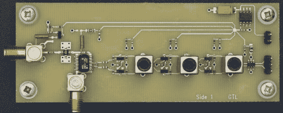

# 更新:滚动你自己的 GPS 现在可以跟踪两倍多的卫星

> 原文：<https://hackaday.com/2012/12/24/update-roll-your-own-gps-can-now-track-twice-as-many-satellites/>

[Andrew Holme]写信给我们，告诉我们他为改进他临时搭建的 GPS 接收器所做的一些工作。他想出了一种方法，使用同样的硬件，但它可以跟踪的卫星数量增加了一倍，达到 8 个。当我们大约一年前查看原始硬件时[，它仅限于监视四颗卫星](http://hackaday.com/2011/10/01/make-your-own-gps-receiver/)。这是计算位置数据的最低要求。这不仅有助于提高精度，而且消除了由于障碍物或其他问题而导致一颗卫星坠落的问题。

他的解决方案完全基于以不同的方式使用 FPGA。他几乎占据了 Xilinx Spartan 3 芯片中所有可用的门。现在，他已经在芯片上实现了一个 CPU，并能够通过在其上运行代码来减少硬件门设计的一些工作。他还发现并解决了数据处理过程中的一个问题。他说他最初的工作在确定位置时没有考虑到地球的旋转。所有这些改进使他的精度达到+/-5 米，即使他没有跟踪所有八颗卫星！