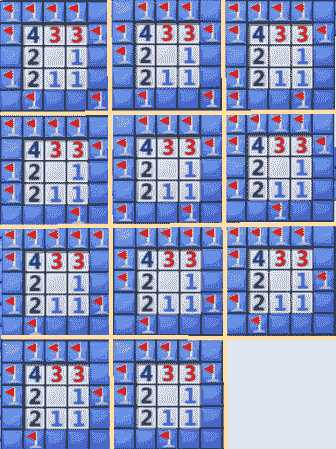

# 如何编写自己的扫雷解决方案

> 原文：<https://hackaday.com/2012/12/24/how-to-write-your-own-minesweeper-solver/>

我们认为我们已经找到了将占用我们假期空闲时间的项目。【李白】刚刚发表了一篇关于[写一个可以自动解决扫雷](http://luckytoilet.wordpress.com/2012/12/23/2125/)游戏的程序的优秀文章。对于那些不熟悉的人来说，[扫雷](http://en.wikipedia.org/wiki/Minesweeper_(video_game))给了你一个网格，其中地雷被随机放置。当你点击盒子显示下面的东西时，你会看到一个数字，代表盒子周围有多少地雷。[白的]项目研究了如何通过编程来解决这个难题。

他选择用 Java 来写求解器。这对于从屏幕上读取以及模拟游戏中的鼠标点击都很有效。该程序的阅读部分使用带有截图的颜色检测。与此相关的有两个问题，数字 1 与未覆盖的正方形颜色几乎相同，数字 7 和 3 使用相同的颜色。输入部分要简单得多，因为他可以使用现有的机器人类。

编写高效求解器背后的逻辑非常有趣。上面显示了一个最有趣的例子。当没有可能的方法来确保安全移动时，您应该怎么做？与传统的国际象棋游戏一样，[白]让求解器计算所有可能的解决方案，并选择最有可能成功的一步。

他的源代码是可以得到的，但是仅仅从概念中破解出来难道不有趣吗？出于某种原因，这似乎比像[宝石迷阵解算器](http://hackaday.com/2011/07/30/bejeweled-blitz-bot-makes-your-high-score-look-just-sad/)更容易接近我们。

[https://player.vimeo.com/video/56183450](https://player.vimeo.com/video/56183450)

[via [Reddit](http://www.reddit.com/r/programming/comments/15c4e1/how_to_write_your_own_minesweeper_ai_very/)