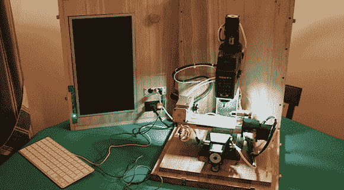

# 便携式数控铣床

> 原文：<https://hackaday.com/2012/12/28/a-portable-cnc-mill/>

铣床是商店里最有用的工具之一，仅次于车床。不过，对[juppiter]来说，一个合适的多吨级工厂会占用太多空间，而且是一笔可观的投资。他对空间问题的解决方案实际上非常聪明:[他将一台小型、廉价的台式铣床改造成数控机床](http://boxedcnc.blogspot.it/)，并将所有东西都放在一个可以轻松收起的漂亮盒子里(意大利语，[这里是翻译](http://translate.google.com/translate?sl=it&tl=en&js=n&prev=_t&hl=en&ie=UTF-8&eotf=1&u=http%3A%2F%2Fboxedcnc.blogspot.it%2F&act=url))。

[juppiter] [为改装](http://boxedcnc.blogspot.it/2012/12/boxedcnc-mf70-parte-iii-la-mf70.html)选择的工厂是一家 [Proxxon MF70](http://www.proxxon.com/eng/html/27110.php) ，这是一家为珠宝商和模型师制造的非常小的工厂。在[购买了包括一些 NEMA 17 电机、轴承和安装板在内的数控转换套件](http://boxedcnc.blogspot.it/2012/12/boxedcnc-mf70-parte-iii-la-conversione.html)后，【juppiter】开始着手驱动这些电机，并用电脑控制它们。对于步进驱动器来说，[一些工业电机驱动器来自易贝](http://boxedcnc.blogspot.it/2012/12/boxedcnc-mf70-parte-v-il-cuore-della-cnc.html)，由[一个内置在轧机机箱中的 i3 miniITX 计算机](http://boxedcnc.blogspot.it/2012/12/boxedcnc-mf70-parte-iv-il-controllo.html)驱动。控制是通过触摸屏液晶显示器和蓝牙键盘和鼠标。

到目前为止，[juppiter]已经制作了一个[非常优雅的木头和黄铜 CNC 控制器](http://boxedcnc.blogspot.it/2012/12/cnc-jog-usb-pendant-steampunk-style.html),允许他转动轴并设置原点位置。这是一个很好的构建，真正展示了这些廉价台式机的力量和能力。