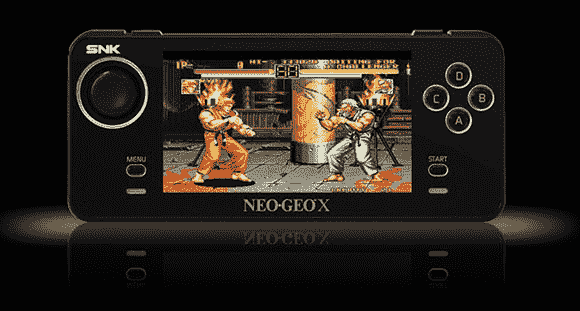

# 打破新的近地天体地理手持大开放

> 原文：<https://hackaday.com/2012/12/30/breaking-the-new-neo-geo-handheld-wide-open/>

如果你不知道，有一个新的近地天体控制台。它被称为 Neo Geo X，并带回了许多 90 年代经典街机游戏的怀旧之痛。在收到他们全新的 Neo Geo 便携式电脑后，Neo Geo 论坛的成员决定对他们最新的一台游戏机进行拆解，并发现了一些有趣的东西:[这是为黑客攻击而制造的](http://www.neo-geo.com/forums/showthread.php?239578-NeoGeoX-Hacking-and-Mods)。

根据官方说法，Neo Geo X 将在 SD 卡上发布新游戏。这些游戏机的第一次运行——黄金版——已经在系统中预装了 20 个游戏，方便地存储在埋在屏幕下面的 microSD 卡上。论坛用户[Lectoid]在查看了这张 microSD 卡后，发现了系统预装的 20 个游戏和 bios，都完全解锁，随时可以进行黑客攻击。

已经有一些论坛成员在这个小巧便携的近地天体 Geo 上运行 AES Unibios，使他们能够玩所有近地天体 Geo 游戏。由于 Neo Geo X 与其他一些手持设备使用相同的处理器，因此完全解锁这个新控制台并在其上运行模拟器的希望很大。