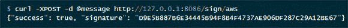

# 构建硬件安全模块

> 原文：<https://hackaday.com/2012/12/31/building-a-hardware-security-module/>

[Stefan]对于将他的 Amazon Web Services 帐户的密钥放入他的配置文件感到紧张。在安全领域，以纯文本形式存储密码被认为是一件非常糟糕的事情。但幸运的是，有很多方法可以绕过它。[Stefan]的解决方案是用最新的 ARM 驱动的 Arduino 制作一个硬件安全模块。

构建将[Stefan]的 AWS 帐户的密钥放在 Arduino 的固件中(当然，Arduino 上的安全位被翻转)。然后，Python web 服务接收签名请求，并通过串行端口与 Due 对话。然后，Due 对请求进行签名，并将其发送给另一段处理 AWS API 的 Python 代码。

由三个字母组成的政府机构经常使用硬件安全模块来管理加密密钥，并确保其数据得到正确加密。与花费数万美元的硬件模块不同，[Stefan]的成本仅相当于一个 Arduino 的价格；对于一个每秒可以签署超过 2000 个请求的硬件安全模块来说，这还算不错。