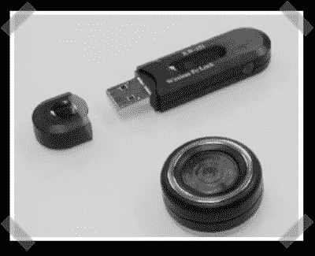

# 黑客历史中的这一天:2005 年 1 月 1 日

> 原文：<https://hackaday.com/2013/01/01/this-day-in-hack-a-day-history-january-1st-2005/>

我们正在玩的一个新功能是在 Hack a Day history 中偶尔回顾这一天。虽然我们仍在激烈争论到底什么，什么时候，如何展示，我们认为今天将是一个伟大的一天介绍这个想法。

所以，在黑客日历史的这一天，我们将追溯到 2005 年的第一个 1 月 1 日。在阅读这篇文章时，有一些有趣的事情需要考虑。在这个时间点上，我们仍然像 1990 年版的《全面召回》中的[夸托]一样，是 engadget 边上的一个增长。我们成立不到一年，还没有完全开发出我们的风格，我们没有真正分享关于这个项目的很多信息，是的，第一个评论是“不是黑客”。

[更好的 USB 无线安全性。2005 年 1 月 1 日。](http://hackaday.com/2005/01/01/better-usb-wireless-security/)

看到小写字体的效果很有趣，看到名字周围缺少[]很不和谐。旧的黑白照片是一个有趣的回忆。