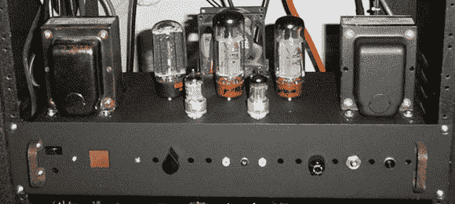

# 弗兰肯斯坦，全电子管家庭影院放大器

> 原文：<https://hackaday.com/2013/01/02/frankenstein-an-all-tube-home-theater-amplifier/>

这是一个我们从未见过的过度练习。在密歇根州立大学读本科时，[格雷戈里]认为建造一个全管道家庭影院系统是个好主意。他称他的 7 英尺高的放大器架为“弗兰肯斯坦”，我们不得不同意这个构建是一个令人印象深刻的工程实力的怪物。

【格雷戈里】的《弗兰肯斯坦》是一套完整的 5.1 家庭影院系统。出于理智的考虑，机架中的大多数设备都是现成的设备，包括 CD 播放器、环绕声处理器和漂亮的麦金托什固态前置放大器。功率放大器是这个建筑真正的亮点。

对于潜艇，[格雷戈里]建立了一个美妙的单体管放大器，能够推动近 300 瓦的低音炮。这个家庭影院系统的其他频道通过[一个巨大的四频道电子管放大器](http://www.glcharvat.com/Dr._Gregory_L._Charvat_Projects/Quad_Tube_Amplifier.html)放大，每个频道提供 480 瓦。在格雷戈里的放大器系统中，总共有 23 根电子管，足以消耗 20 安培的灯丝电流。

休息之后，你可以看看[Gregory]的系统演示视频。

[https://www.youtube.com/embed/n8PRiR43TSU?version=3&rel=1&showsearch=0&showinfo=1&iv_load_policy=1&fs=1&hl=en-US&autohide=2&wmode=transparent](https://www.youtube.com/embed/n8PRiR43TSU?version=3&rel=1&showsearch=0&showinfo=1&iv_load_policy=1&fs=1&hl=en-US&autohide=2&wmode=transparent)