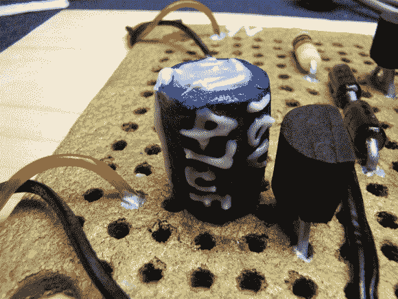

# 一个好到可以吃的放大电路

> 原文：<https://hackaday.com/2013/01/02/an-amplifier-circuit-good-enough-to-eat/>

[迪诺的]厨房技能与他的硬件黑客技术相匹配。仔细观察上图，你会发现[这些晶体管和无源元件是可以食用的](http://hackaweek.com/hacks/?p=1036)。他没有为节日装饰饼干，而是用姜饼、糖霜和糖果制作了这个音频放大器。

问题是，[迪诺]几乎总是对他的演讲有额外的触动。如果你在休息后看视频，你会注意到声音不是我们习惯在他的视频中听到的水晶般清晰的质量。这是因为他使用了[制作可食用产品的硬件](http://hackaday.com/2011/08/14/build-your-own-class-ab-audio-amplifier/)来制作演示剪辑的音频。

使用 Express PCB 完成设计后，他开始着手工作。底座是姜饼，看起来就像一个方形的无线电室原型板。为了制造二极管，他在螺丝刀周围卷起一些锡箔，用作糖和水的模具，糖和水已经煮沸足够长的时间，呈现出深色。类似的技术被用来铸造其他部分。所有的东西都用糖霜和红色和黑色的甘草条绑在一起。

[https://www.youtube.com/embed/nMrNFcf7FtE?version=3&rel=1&showsearch=0&showinfo=1&iv_load_policy=1&fs=1&hl=en-US&autohide=2&wmode=transparent](https://www.youtube.com/embed/nMrNFcf7FtE?version=3&rel=1&showsearch=0&showinfo=1&iv_load_policy=1&fs=1&hl=en-US&autohide=2&wmode=transparent)