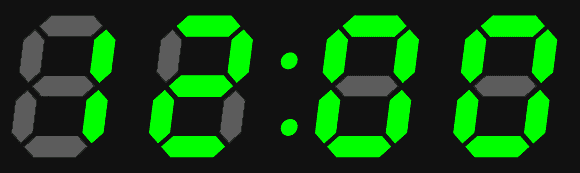

# 带 AVR 的精确定时器

> 原文：<https://hackaday.com/2013/01/03/accurate-timers-with-an-avr/>

大量微控制器项目使用定时器每隔几分钟、几小时或几天重复一次动作。虽然这些计时器可以像廉价的数字手表一样精确，但有时你需要一个微控制器的计时器来精确测量*，一天的误差不会超过几毫秒。[正如【卡尔】在一个教程中向我们展示的那样，让计时器达到这种精度](http://www.seanet.com/~karllunt/interval.html)并不困难。*

 *微控制器保持时间的问题与您选择的芯片的晶体、时钟频率和硬件预分频器有关。[Karl]用 ATMega168 和 20 MHz 晶振以及设置为 256 的预分频器开始了他的项目。这使得每秒中断 78.125 次，但浮点运算的缺乏意味着微控制器的一秒对你我来说将是 0.9984 秒。

[Karl]对这个问题的解决方案是让 ATMega 在 7 秒内每秒钟计数 78 个中断，然后在 1 秒钟内计数 79 个中断。这并不十分复杂，现在[卡尔]的计时器就像 168 年的时钟所用的水晶一样精确。*