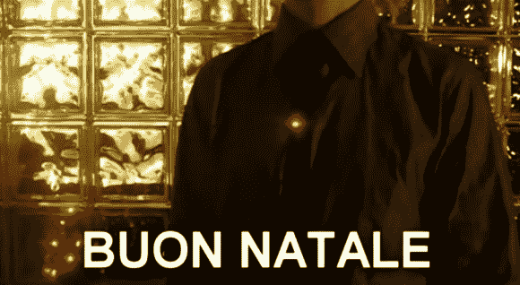

# 领带大头针发送莫尔斯电码季节问候

> 原文：<https://hackaday.com/2013/01/03/tie-tack-sends-morse-code-seasons-greetings/>

因为大卫·吉罗尼今年做了一个节日领带。它不是做得像圣诞老人、雪人或圣诞树。他只是通过用莫尔斯电码闪烁信息来祝你圣诞快乐。

两个发光二极管已被添加到一个简单的领带钉。它与逻辑电路相连，逻辑电路提供电源并相应地驱动红色和蓝色的灯。正如你在休息后的视频中看到的，红色表示一个字母的结束，或长或短的蓝色闪烁对应于破折号或圆点。这不需要很大的马力，所以他用了一个 8 引脚的 ATtiny13 微控制器(如果你足够努力的话，你可能会在灯泡中找到这样的一个)。设备的其余部分包括几个电阻、一个按钮和一个用于供电的硬币电池。[Davide]使用他从不同项目中学到的字节打包技术，将每个字母存储为一个 8 位包，这意味着芯片内存中有足够的空间来存储您的信息。

[https://www.youtube.com/embed/LBgKzvk4frc?version=3&rel=1&showsearch=0&showinfo=1&iv_load_policy=1&fs=1&hl=en-US&autohide=2&wmode=transparent](https://www.youtube.com/embed/LBgKzvk4frc?version=3&rel=1&showsearch=0&showinfo=1&iv_load_policy=1&fs=1&hl=en-US&autohide=2&wmode=transparent)