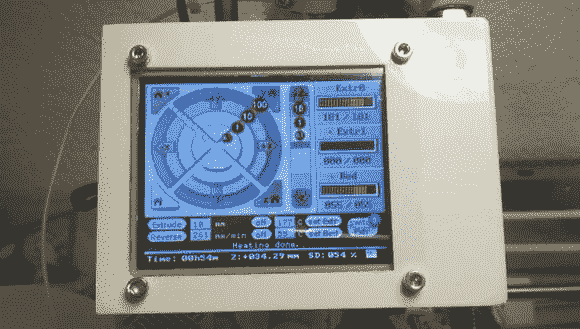

# 用于 Reprap 的触摸屏控制

> 原文：<https://hackaday.com/2013/01/04/touchscreen-control-for-a-reprap/>

当你让 Reprap 以可接受的分辨率和高质量打印流畅运行后，任何 3D 打印机爱好者的下一步工作就是无头打印。虽然最棒和最新的 3D 打印机都带有控制功能，允许慢跑、归位、温度控制和从 SD 卡打印，但自制版本需要在电子板上附加一个附件。[Marco]一直在花时间改进我们在 Repraps [中看到的字符 LCD 控制面板项目，它有一个令人敬畏的图形版本](http://www.marcoantonini.eu/doku.php?id=reprap:lcd4d)，模拟 Pronterface 控制软件中的控制界面。

将控制接口添加到 Reprap 的最大问题是电路板上可用的引脚数量。虽然像 [RAMPS](http://reprap.org/wiki/RAMPS_1.4) 这样的电子板有足够的备用 I/O 引脚来驱动显示器，但其他板如 [Sanguinololu](http://reprap.org/wiki/Sanguinololu) 和 [Melzi](http://reprap.org/wiki/Melzi) 在可扩展性方面极其有限。为了绕过这个限制，[Marco]使用了 [4D 系统公司的串行触摸屏显示器](http://www.4dsystems.com.au/prod.php?id=114)。

该显示器仅需要两个引脚来与运行 Marlin 固件的打印机完全交互；图形处理、通信和 SD 卡访问由板载 PICASO 微控制器处理，使电子板上的 ATMega 可以自由处理重要的事情，如用塑料打印东西。

[马可]有一个装满了[修改过的马林固件](https://github.com/MarcoAntonini/Marlin)和用于[4D 系统显示器](https://github.com/MarcoAntonini/ReprRapLcd4D)的固件的 git。还有一个[整洁的显示器印刷外壳](http://www.thingiverse.com/thing:38749)，使一个非常专业的独立控制器成为一个周末项目，而不是长达数月的折磨。

感谢[Antonio]发送此邮件。