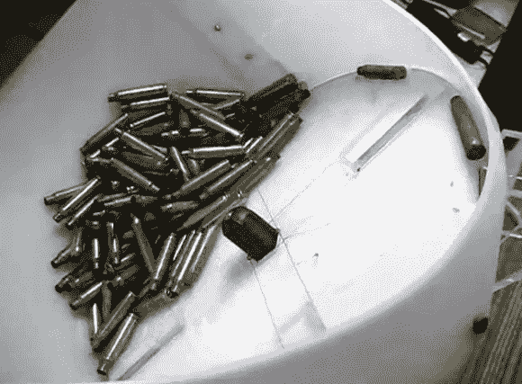

# 进弹器让你的弹药装填更有效率

> 原文：<https://hackaday.com/2013/01/04/case-feeder-makes-your-ammo-reloading-more-efficient/>

对于那些自己重装弹药的人来说，你知道搞清楚一个高效的装配线流程会让你的会议更加愉快和富有成效。[Msoejacobsk]知道他可以为他的系统购买一个案例馈送器，但不想为此支付 200 美元。经过一番思考后，他花了大约 10 美元造出了这个箱子输送器。

钻机的目的是正确定位每个空套管，并将其输送到重装硬件。这是通过首先使用这种有角度的滚筒一次分离一个外壳来实现的。构成地板的圆盘上开有一个套管大小的槽。当该槽到达其旋转的最高点时，有一个开口，外壳通过该开口落下。为了确保正确的方向，在开口的中间放置了一根 V 形的粗铁丝。这就像一个支点，让较重的底座向那个方向拉动外壳。你可以在休息后的片段中看到这种情况。

[https://www.youtube.com/embed/JH-7d9IuVqY?version=3&rel=1&showsearch=0&showinfo=1&iv_load_policy=1&fs=1&hl=en-US&autohide=2&wmode=transparent](https://www.youtube.com/embed/JH-7d9IuVqY?version=3&rel=1&showsearch=0&showinfo=1&iv_load_policy=1&fs=1&hl=en-US&autohide=2&wmode=transparent)

[谢谢亚历克斯]