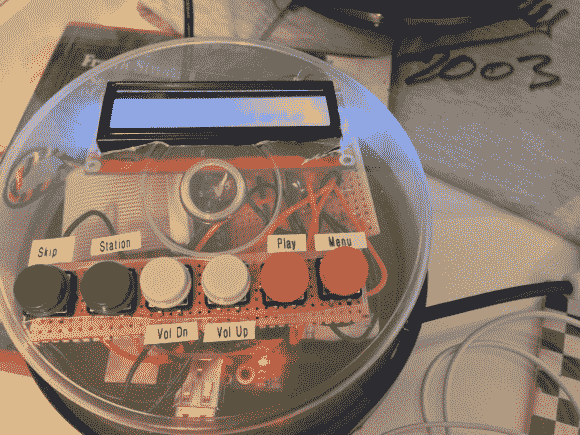

# 围绕树莓派打造的专用 Pandora 播放器加 AirPlay

> 原文：<https://hackaday.com/2013/01/04/dedicated-pandora-player-plus-airplay-built-around-the-raspberry-pi/>

[肖恩·格林]想要一个网络收音机播放器。虽然他在前进的道路上确实遇到了一些麻烦，但最终的项目结果非常好。在这个曾经放着一堆平淡无奇的 CD 的盒子里，藏着一个树莓皮，它可以播放潘多拉电台，也可以作为一个无线播放接收器。

RPi 的 GPIO 头使得这个项目变得容易多了。[Shaun]使用 Adafruit 的分线板焊接六个按钮和字符 LCD 屏幕的连接。将一些扬声器插入音频插孔，硬件方面的交易就完成了。软件方面的事情与我们在 9 月份看到的 BeagleBone Pandora 播放器非常相似。它使用 Linux 发行版(Rasbian Weezy)和 Pianobar 包。

Pianobar 很全能。您可以使用先进先出文件来控制它。一旦[Shaun]发现如何使用 mkfifo 来设置文件，他就能够通过监控按钮的按下并向 fifo 回显相关命令来从脚本中控制它。点睛之笔是通过 shairport 包添加 AirPlay 支持。