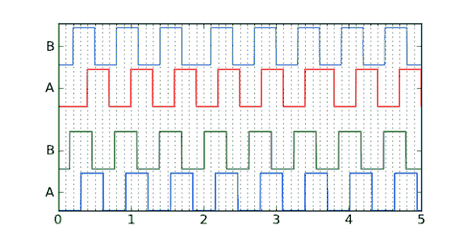

# 使用正交编码器数据估计速度

> 原文：<https://hackaday.com/2013/01/04/estimate-velocity-using-quadrature-encoder-data/>

许多电机提供正交编码器，反馈电机轴是否移动以及移动方向。但是如果你善于分析数据，你可以使用正交编码器来估算电机速度。[Jason Sachs]认为这很容易出错。幸运的是，他已经仔细地展示了从两个边缘触发数据源推断速度的过程。

该过程从从编码器读取开始。许多芯片都有与旋转编码器接口的外围设备，但缺少内置助手的硬件仍可以通过监控引脚变化中断来使用。一旦随着时间的推移获取了连接的样本，剩下的就交给算法的质量了。

这个速度数据可以用来做什么？这取决于你。但是我们可以想到几个项目。这可能是有用的旋转视点显示像[这种基于 FPGA 的美丽](http://hackaday.com/2012/09/11/full-color-video-on-a-spinning-pov-display/)。你也可以在运动器材中找到[正交编码器。如果你正在建造自己的电脑来取代跑步机自带的电脑，了解速度会有所帮助。](http://hackaday.com/2010/11/24/the-quest-to-build-a-better-stairmaster/)

[via [Reddit](http://www.reddit.com/r/electronics/comments/15w1kd/how_to_estimate_encoder_velocity_without_making/)