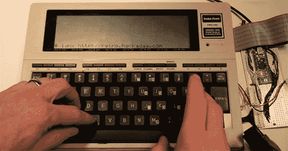

# 为 TRS-80 构建新的主板

> 原文：<https://hackaday.com/2013/01/07/building-a-new-motherboard-for-a-trs-80/>

TRS-80 型号 100 在发布时是一个令人惊叹的套件。仅用四节 AA 电池就能运行一周，比今天的一些笔记本电脑还要小，这种便携式版本的 TRS-80 见证了战地记者报道福克兰群岛入侵的行动。MacBook Pro 的血统似乎永远无法与之媲美。

[Hudson]拿起一个不起作用的 Model 100，其明确的目标是[用更新的主板](http://www.nycresistor.com/2013/01/06/trs80-model100-upgrade/)替换内部 30 年的电子设备，并在此过程中打开[我们的复古网站](http://retro.hackaday.com/)。[Hudson]用 Teensy++武装起来，撬开他的旧电脑，开始将显示器和键盘连接到他的 AVR 开发板。

100 型液晶显示器的分辨率为 240×64，由 10 个日立 HD44102 显示器驱动程序驱动。每个显示驱动器负责屏幕上一个 50×32 矩形中的像素，并与一条 30 位宽总线接口，该总线由芯片选择线、8 位数据总线和一些其它随机控制线组成。[Hudson]将这个 30 针接头插入他的 Teensy++中，在对 LCD 的奇怪电气要求进行了一点独创性之后，他能够控制这个 30 年历史的显示器上的每个像素。

下一步是将键盘与现代微控制器连接起来。键盘以正常的矩阵布局，但是有一些奇怪的地方:像~、|和花括号这样的字符在 100 型上没有。解决了这些问题后，[Hudson]开始着手 VT100 终端模拟器的工作。这允许他运行 vi 和 lynx，使他能够[以一种奇妙的 40 列文本模式打开 Hackaday retro 站点](http://www.flickr.com/photos/osr/8351735669)。

这种重新设计的未来改进包括设计合适的 PCB 来取代当前的原型板设计。最初的 Model 100 包括一个文本编辑器和编程语言，添加第四个实现也不是[Hudson]力所能及的。这是一个令人敬畏的建设，一个出色的改进，将允许[哈德逊]的垃圾-80 看到另一个 30 年的使用。